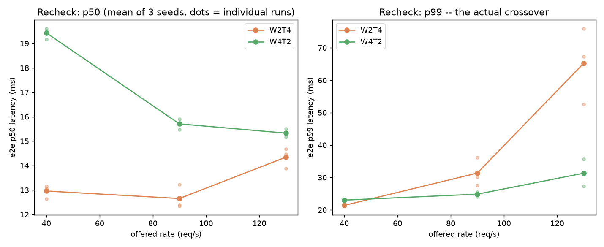
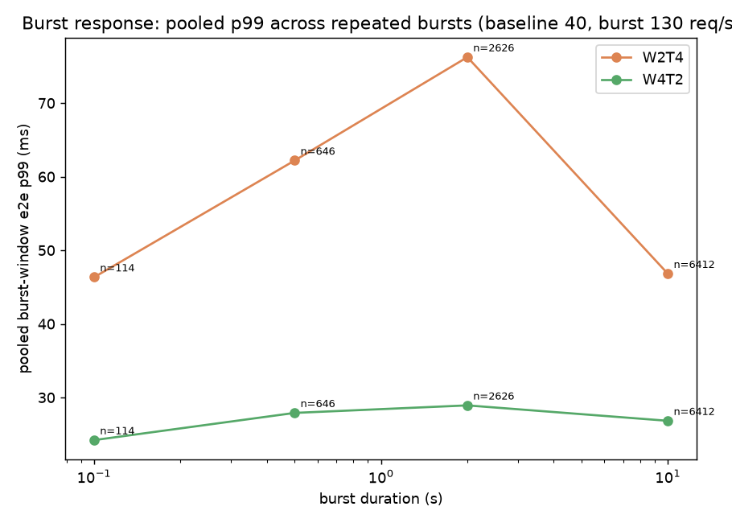

# SwitchCost: CPU Inference Scheduling Experiments

A reproducible benchmarking project studying how a CPU inference server's worker/thread configuration affects latency under steady and changing request traffic.

**This is not a proven adaptive scheduler and not a completed research paper.** It's a set of controlled experiments, a load-testing harness built for them, and an honestly-reported result: the specific switching mechanism this project set out to evaluate is not (yet) shown to be worth building.

## The question

If a CPU inference server can pick how many worker processes to run and how many threads each one uses (within a fixed total CPU budget), does the best choice depend on the traffic it's currently receiving — and if so, is there enough headroom above a good *fixed* choice to justify a controller that switches between configurations at runtime?

This project answers the first half of that question for one workload on one machine, and reports why it stopped before building the controller.

## Notation: WxTy

A configuration is written **W`x`T`y`**: **`x` worker processes**, each running an ONNX Runtime session with **`y` intra-op threads**. Every configuration in this project uses the same total CPU budget (8 logical CPUs), so `x * y = 8` for all four tested configurations:

| Config | Workers | Threads/worker |
|---|---|---|
| W1T8 | 1 | 8 |
| W2T4 | 2 | 4 |
| W4T2 | 4 | 2 |
| W8T1 | 8 | 1 |

More workers means more requests can be served concurrently (each worker only runs one request at a time); more threads per worker means each individual request finishes faster (ONNX Runtime parallelizes a single inference call across its intra-op threads). The two knobs trade against each other under a fixed CPU budget.

## Main finding

**For the tested MiniLM embedding workload on this WSL2 workstation, fixed W4T2 achieved the lowest whole-trace p99 latency across every time-varying traffic pattern tested. We did not demonstrate enough benefit over that fixed baseline to justify developing the proposed switching mechanism further.**

This conclusion is limited to the tested setup (see [Limitations](#limitations)) — it is not a general claim about worker/thread scheduling.

What we did find, and can support with data:

- Across four configurations (W1T8, W2T4, W4T2, W8T1) at three fixed traffic rates, **W1T8 wins narrowly at low load but its tail latency collapses under higher load** (30–50x worse p99 at the highest tested rate) — it isn't part of the interesting trade-off. ([`results/sweep/`](results/sweep/), plot below)
- Between the two configurations that stayed competitive, **W2T4 has the lowest median (p50) latency at every rate tested; W4T2 has the lowest tail (p99) latency at medium and high load.** This was checked with a higher-sample-size, higher-repeat recheck after the initial finding (≥5,000 requests per condition, 3 seeds). ([`results/recheck/`](results/recheck/), plot below)
- The same pattern held under **time-varying** traffic — a sustained load ramp (40→130→40 req/s) and repeated short bursts (baseline 40 req/s, bursts to 130 req/s, durations 0.1–10s): W4T2's tail latency stayed comparatively flat across every condition; W2T4's tail latency degraded substantially, especially during and shortly after load spikes. ([`results/time_varying/`](results/time_varying/), plots below)

<p>
  
</p>

<p>
  
</p>

More plots: [`results/plots/`](results/plots/). Full numeric detail, including every intermediate finding and correction along the way: [`results/REVIEW.md`](results/REVIEW.md) and [`docs/research_log.md`](docs/research_log.md).

### Why we stopped here

The project's own go/no-go plan ([`docs/pilot_config_matrix.md`](docs/pilot_config_matrix.md)) was to build a switching controller only if (1) different fixed configurations actually win under different traffic, (2) transition costs between configurations are small enough to matter, and (3) there's headroom above simply picking a strong fixed configuration. Criterion 1 held up under scrutiny (two rounds of independent review of the raw data, plus the higher-rigor recheck). We did not get far enough to test criterion 2 (transition cost) or criterion 3 (headroom above a fixed baseline) with enough confidence, and everywhere we looked, one fixed choice (W4T2) or the other (W2T4) already covered most of the observed trade-off — so a controller currently has a narrow, unproven case to make. We stopped rather than build a controller to chase a benefit we hadn't demonstrated.

## Hardware, OS, model, and runtime versions

| | |
|---|---|
| CPU | Intel Xeon Silver 4210, 2 sockets, 20 physical cores / 40 logical threads total (not fully visible to the guest OS — see [Limitations](#limitations)) |
| RAM | 64 GB DDR4 (WSL2 guest saw ~31 GB at experiment time) |
| Host OS | Windows, with WSL2 (Ubuntu 26.04.1 LTS, kernel `6.6.87.2-microsoft-standard-WSL2`) |
| GPU | NVIDIA Quadro P1000 — present but **not used**; all experiments are CPU-only |
| Model | [`sentence-transformers/all-MiniLM-L6-v2`](https://huggingface.co/sentence-transformers/all-MiniLM-L6-v2), pinned to commit [`1110a243fdf4706b3f48f1d95db1a4f5529b4d41`](https://huggingface.co/sentence-transformers/all-MiniLM-L6-v2/commit/1110a243fdf4706b3f48f1d95db1a4f5529b4d41), exported to ONNX opset 17 (backbone only; pooling/normalization done outside the graph, see `docs/pilot_config_matrix.md` §10) |
| Python | 3.14.4 |
| Key packages | `onnxruntime==1.30.0`, `torch==2.14.0+cpu`, `transformers==5.17.0`, `sentence-transformers==6.0.1`, `onnx==1.22.0`, `numpy==2.5.3` — full pinned list in [`requirements.txt`](requirements.txt) |

Full environment inspection, including what WSL2 does and doesn't expose accurately (CPU topology, NUMA, memory): [`docs/environment_report.md`](docs/environment_report.md).

## Setup

```bash
git clone <this-repo-url>
cd switchcost
./scripts/setup_env.sh          # creates .venv, installs torch (CPU build) + requirements.txt
source .venv/bin/activate

python scripts/export_model.py       # downloads and exports the pinned model revision to ONNX
python scripts/build_corpus.py       # generates the fixed synthetic sentence corpus
python scripts/pretokenize.py        # pretokenizes it to fixed-length arrays
python scripts/verify_correctness.py # confirms the ONNX path matches the reference model (should print PASS)
```

Everything installs into a project-local `.venv/` — nothing is installed system-wide. `torch` needs the CPU-only wheel index (see `scripts/setup_env.sh`), which is why it's a separate `pip install` step before `requirements.txt`.

## Running experiments

### Smoke test (~15 seconds)

Confirms the harness runs end-to-end on your machine before committing to a longer experiment:

```bash
python scripts/smoke_bench.py --config W2T4 --rate 20 --duration 10 --out results/smoke_test
```

Prints a summary (outcome counts, latency percentiles) and writes `results/smoke_test/{raw_requests.csv,summary.json}`.

### Longer experiments (minutes, not seconds — see estimates)

These reproduce the phases behind the main finding. Each is a Python driver script that runs `smoke_bench.py` many times with different configs/rates/seeds and writes a combined summary CSV.

```bash
# ~3 minutes (20 runs): probes 4 configs x 5 rates to find saturation points
python scripts/run_calibration.py

# ~8 minutes (36 runs): all 4 configs x 3 rates x 3 repeats, matched schedules
python scripts/run_sweep.py

# ~24 minutes (18 runs): W2T4 vs W4T2 only, 3 seeds, >=5,000 requests/condition
python scripts/run_recheck.py

# ~22 minutes (12 runs): sustained load-change and repeated-burst traces, W2T4 vs W4T2
python scripts/run_time_varying.py

# analysis + plots, fast, reads the results/ produced above
python scripts/analyze_time_varying.py
python scripts/plot_results.py

# dedicated unloaded IPC-overhead measurement (~1 minute)
python scripts/measure_ipc_floor.py
```

All of these write into `results/<phase>/`, alongside the results already checked into this repo from the original run (see [Data and reproducibility](#data-and-reproducibility) for exactly what's included).

### Which harness version produced which result

The harness went through three rounds of fixes (two from independent review of the raw data, one from a scope extension) during this project. Every `summary.json` records the exact git commit active when it was generated (`git_commit` field) — note that because code fixes and the experiment runs that used them are typically committed together *after* the run, that field is usually the *parent* of the commit where the result file itself appears in `git log`, not that commit itself. The reliable way to check which fixes were active for a given result is the fields present in its `summary.json`:

| Phase | Harness state | Tell-tale field |
|---|---|---|
| `results/verification/` | pre-review, initial harness | — (baseline) |
| `results/calibration/`, `results/sweep/` | round-1 fixes applied (percentile convention, timeout semantics, IPC-floor labeling, shutdown accounting, missing measurements, arrival-duration bookkeeping) | `percentile_method` present |
| `results/verification2/`, `results/recheck/` | round-2 fixes also applied (materialized input arrays, generator-thread affinity verification, forced-shutdown write ordering, rate/throughput reporting) | `achieved_arrival_rate_hz_over_nominal_duration` present |
| `results/time_varying/` | harness extended for multi-phase traces, same round-2 fixes | `latency_ms_by_phase` present |

Full detail on every fix, what it changed, and its measured effect: [`docs/research_log.md`](docs/research_log.md) and [`results/REVIEW.md`](results/REVIEW.md).

## Data and reproducibility

Every run's `summary.json` (all computed statistics) is included in this repository. Raw per-request logs (`raw_requests.csv`) are included in full for the `time_varying/` phase (needed to reproduce its pooled burst statistics) and as a representative sample for the other phases — see [`results/README.md`](results/README.md) for exactly which runs. Full raw logs for every run are kept locally by the authors; there is no hosted download for them, but every run is exactly reproducible from its recorded configuration (rate/duration/seed, or trace file) using the commands above.

## Limitations

- **WSL2, not native Linux.** The guest OS does not expose the host's real 2-socket CPU topology or NUMA layout — CPU pinning in this project operates on guest-assigned logical CPUs, which the environment report ([`docs/environment_report.md`](docs/environment_report.md)) verifies do *not* reliably correspond to physical cores or sockets. Results may not transfer to a bare-metal or differently-virtualized deployment.
- **One machine, one model.** All results are from a single Xeon Silver 4210 workstation and a single small (~22M-parameter) sentence-embedding model. Different hardware, a larger model, or a different workload shape could change which configuration wins where.
- **Short, synthetic inputs.** The benchmark corpus is 240 template-generated sentences (9–23 tokens), not real production traffic or a standard NLP benchmark — see [`scripts/build_corpus.py`](scripts/build_corpus.py).
- **Limited repetitions.** The recheck used 3 seeds per condition; the time-varying traces used 2 seeds (sustained) or pooled repeated bursts within one trace (bursts) rather than fully independent repeats. This is enough to see the reported effects hold up and even strengthen under more scrutiny, but it is not the larger repeat count a final, publishable result would need.
- **No adaptive controller was built or evaluated.** This project measured whether fixed configurations trade off under changing traffic. It does not evaluate any switching policy, transition mechanism, or transition cost — those questions are open, not answered, in either direction.

## Attribution and licensing

This project's own license has not yet been chosen (no `LICENSE` file is included yet — that's a pending decision, not an omission to read into).

Third-party components used, under their own licenses:
- Model: [`sentence-transformers/all-MiniLM-L6-v2`](https://huggingface.co/sentence-transformers/all-MiniLM-L6-v2) — Apache License 2.0, per its Hugging Face model card. Built on `nreimers/MiniLM-L6-H384-uncased`.
- Libraries: ONNX Runtime (MIT), PyTorch (BSD-3-Clause), Hugging Face `transformers` and `sentence-transformers` (Apache License 2.0), NumPy (BSD-3-Clause) — see [`requirements.txt`](requirements.txt) for the full pinned dependency list and consult each project for its current license terms.

## Acknowledgments

Implementation, experiment design, and review for this project were done with the assistance of Anthropic's Claude Code (which wrote and iterated on the harness and analysis code and drafted documentation) and OpenAI's ChatGPT (which independently reviewed raw experiment logs and methodology across multiple rounds, catching several real measurement bugs that are documented and fixed in this repo's history). All findings and conclusions were checked against the actual data before being reported.
